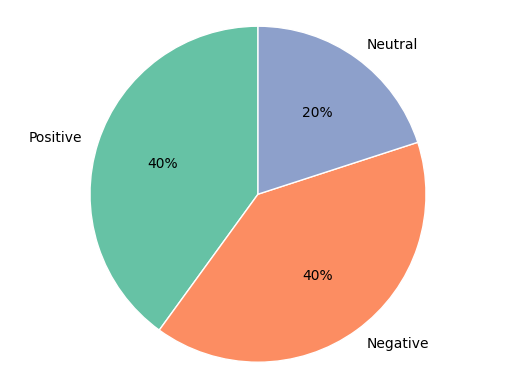

# Lyra Sentiment Classifier (n8n + GPT-4.1 nano)

This project demonstrates a fast and modular sentiment analysis workflow using **n8n**, integrated with **GPT-4.1 nano** via OpenAI Assistant, and routing results to separate **Google Sheets** based on sentiment category.

# 🛠 Workflow Structure

## 🌐 Overview

- 🔁 Loops over multiple short texts from a Google Sheet
- 🧠 Sends each text to a custom GPT assistant for sentiment analysis
- ⚖️ Parses the output JSON (`{ "sentiment": "Positive" }`)
- 🧭 Routes to one of three categories: **Positive**, **Negative**, **Neutral**
- ⏱️ Includes a `Wait` node (500 ms) to regulate API call frequency
- 📄 Appends results to the corresponding sentiment-specific Google Sheet


## 🔁 Parsing Logic (JS node)

```javascript
const parsed = JSON.parse($json.output);
return { sentiment: parsed.sentiment };
```

## 🧠 Prompt used in GPT Assistant

```txt
You are a sentiment analysis assistant. Categorize the sentiment of the input text as one of: "Positive", "Neutral", or "Negative".

Return only a JSON object with the following structure:

{ "sentiment": "Positive" }

Do not add any commentary, explanation, or text outside the JSON object.
```
## 📊 Post-processing with GPT Agent

After classifying and storing comments into three sentiment categories (Positive, Negative, Neutral), we used a GPT Agent to analyze the outputs and generate summary statistics and a visualization.

### 🤖 Agent Prompt

```text
You are an AI agent analyzing three Google Sheets labeled “Positive”, “Neutral”, and “Negative”.
Each contains a list of comments classified by sentiment (excluding the header row).
Your task: count the number of entries in each sheet, compute the percentages, and return a readable summary.

```
📈 Result
Positive: 6 items → 40%
Negative: 6 items → 40%
Neutral: 3 items → 20%

Total: 15 comments

Sentiment is evenly split between Positive and Negative, with fewer Neutral entries.


🥧 Visualization




This final step demonstrates how GPT Agents can autonomously interpret structured outputs, compute statistics, and provide insights in natural language — making the pipeline fully intelligent and actionable.

## 🧪 Usage Notes

- Works best for up to 20–50 texts per run.
- A `Wait 500 ms` block is used after each LLM call to prevent throttling.
- Each sentiment type is logged in a separate Google Sheet.

## 📤 Importing the Workflow

To import the workflow into your own instance of n8n:

1. Go to **n8n.io** or your self-hosted instance.
2. Import the JSON file from `code/Sentiment_Analysis_workflow.json`.
3. Configure your **Google Sheets** and **OpenAI credentials**.
4. Add your GPT Assistant with the provided prompt.

## 💾 Folder Structure

```
/Sentiment_Analysis/                                # Root folder of the project
├── /screenshot/                                    # Contains illustrative images for documentation
│   └── Workflow.png                                # Visual representation of the n8n workflow
│   └── pie_chart.png                               # Pie chart visualization generated by GPT Agent
├── /code/                                          # Source code and configuration files
│   ├── JS Parsing.txt                              # JavaScript snippet for parsing GPT output
│   └── Sentiment_Analysis_workflow.json            # Full exported n8n workflow in JSON format
└── README.md                                       # Main documentation file (Markdown)
```

© 2025 – Project by Jérôme (Lyra)
